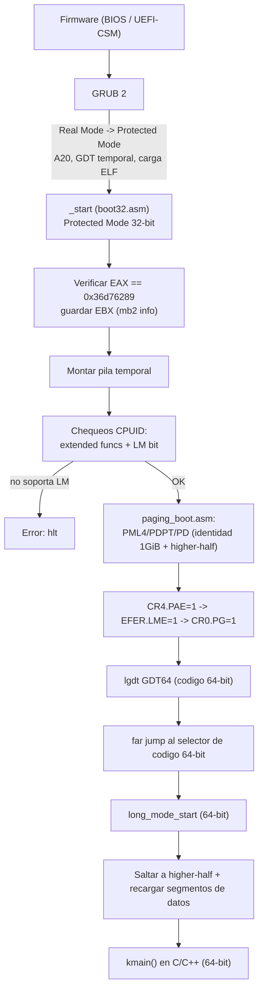

# Arrowix OS - Flujo de Arranque (Boot Flow)

Este documento describe como Arrowix OS pasa del firmware hasta `kmain` en 64 bits.

## Resumen

Con GRUB + Multiboot2 **no escribimos codigo de Modo Real**. GRUB realiza la
transicion de Modo Real a Modo Protegido por nosotros: habilita la linea A20, instala
una GDT temporal, carga nuestro kernel ELF en memoria y nos transfiere control en
**Modo Protegido de 32 bits**, con paginacion **desactivada**.

El trabajo que posee Arrowix es la transicion **Modo Protegido (32-bit) -> Long Mode
(64-bit)**, seguido del salto al kernel higher-half.

## Estado al recibir control desde GRUB

Cuando GRUB salta a nuestro punto de entrada (`_start` en `boot/boot32.asm`):

- CPU en Modo Protegido de 32 bits, paginacion OFF, interrupciones OFF.
- `EAX = 0x36d76289` (magic de Multiboot2; debe verificarse).
- `EBX = ` direccion fisica de la estructura de informacion de Multiboot2
  (mapa de memoria, framebuffer, modulos, etc.).
- Segmentos planos (base 0, limite 4 GiB) definidos por la GDT de GRUB.
- A20 habilitada.

## Diagrama

## Secuencia detallada de la transicion a Long Mode

Implementada principalmente en `boot/long_mode.asm` (y apoyada por
`boot/paging_boot.asm` y `boot/gdt64.asm`):

1. **Validar Multiboot2:** comparar `EAX` con `0x36d76289`. Si no coincide, abortar.
2. **Preservar `EBX`:** guardar el puntero a la info de Multiboot2 para pasarlo a
   `kmain` (en `RDI` segun la ABI System V de 64 bits).
3. **Chequear CPUID/Long Mode:**
   - Confirmar que CPUID esta disponible (flag ID en EFLAGS conmutamble).
   - `CPUID EAX=0x80000000` debe devolver `>= 0x80000001`.
   - `CPUID EAX=0x80000001`: `EDX` bit 29 (LM) debe estar a 1.
4. **Construir tablas de paginas** (ver `paging.md`): identidad de 1 GiB + higher-half.
5. **Cargar `CR3`** con la direccion fisica del PML4.
6. **Habilitar PAE:** `CR4 |= (1 << 5)`.
7. **Habilitar Long Mode en EFER:** `rdmsr`/`wrmsr` sobre `IA32_EFER (0xC0000080)`,
   set bit 8 (LME).
8. **Habilitar paginacion:** `CR0 |= (1 << 31)` (PG). La CPU entra en
   **modo compatibilidad** (Long Mode con codigo de 32 bits).
9. **Cargar GDT de 64 bits** (`lgdt`) con un descriptor de codigo de 64 bits (flag L).
10. **Far jump** al selector de codigo de 64 bits -> Long Mode de 64 bits completo.
11. **Recargar segmentos de datos** (a un descriptor nulo/datos) y saltar a la
    direccion higher-half del kernel.
12. **Llamar a `kmain`** pasando el puntero de Multiboot2.

## Por que identidad + higher-half simultaneamente

En el instante en que se activa `CR0.PG`, el `EIP/RIP` siguiente debe seguir siendo
valido. El codigo del bootstub se ejecuta en direcciones bajas (fisicas), por lo que
necesitamos un **identity map** de la memoria baja. Al mismo tiempo, el kernel esta
enlazado en `0xFFFFFFFF80000000` (ver `linker/kernel.ld`), asi que tambien mapeamos
ese rango. El far jump nos lleva a la mitad alta; despues podemos descartar el
identity map en la Fase 3 cuando el VMM reconstruye las tablas definitivas.

## Salida de depuracion temprana

Desde el primer momento usamos el puerto serie COM1 (`drivers/serial/uart16550.c`) y,
en paralelo, el buffer de texto VGA (`0xB8000`) para verificar visualmente el avance
antes de tener un framebuffer.
