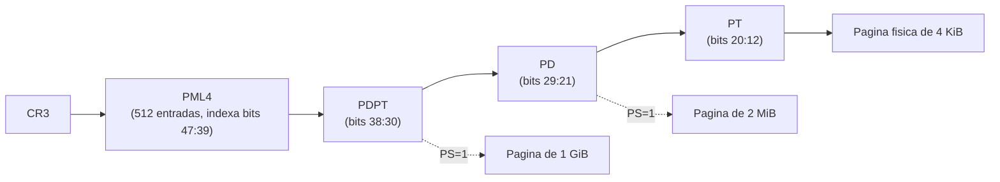

# Arrowix OS - Paginacion y Tablas de Paginas Iniciales

x86_64 en Long Mode usa **paginacion de 4 niveles** (opcionalmente 5 con LA57). Arrowix
usa 4 niveles. Este documento define las tablas iniciales del bootstub y la estrategia
de gestion posterior.

## Jerarquia de 4 niveles



- Cada tabla tiene 512 entradas de 8 bytes (4 KiB por tabla).
- Una direccion virtual de 48 bits canonica se descompone en indices de 9 bits por
  nivel + offset de 12 bits.
- Con `PS=1` en PD se obtienen paginas de 2 MiB (sin PT); en PDPT, 1 GiB.

## Tablas iniciales del bootstub

Para arrancar rapido y sin complejidad, el bootstub mapea con **paginas de 2 MiB**
(bit `PS=1` en el PD), reservando las tablas en `.bss` del bootstub, alineadas a 4 KiB.

Mapeos creados antes de activar paginacion:

- **Identity map** de los primeros **1 GiB**: `virtual == fisica` para `0x0 .. 0x40000000`.
  Necesario para que el codigo del bootstub siga ejecutandose justo tras `CR0.PG=1`.
- **Higher-half map**: el mismo primer GiB fisico tambien mapeado en
  `0xFFFFFFFF80000000` (-2 GiB), donde el kernel esta enlazado.

Estructura logica de entradas:

```text
PML4[0]   -> PDPT_low    ; cubre 0x0000000000000000 (identity)
PML4[511] -> PDPT_high   ; cubre 0xFFFFFF8000000000.. (incluye -2GiB del kernel)

PDPT_low[0]    -> PD_low
PDPT_high[510] -> PD_high   ; indice de 0xFFFFFFFF80000000 en el PDPT alto

PD_low[i]  = (i * 2MiB)            | PRESENT | RW | PS   ; i = 0..511 -> 1 GiB
PD_high[i] = (i * 2MiB)            | PRESENT | RW | PS   ; i = 0..511 -> 1 GiB
```

> Nota: los indices exactos (p. ej. `PML4[511]`, `PDPT_high[510]`) se derivan de
> descomponer `0xFFFFFFFF80000000`. Se documentan y verifican en el codigo de
> `boot/paging_boot.asm`.

## Bits relevantes de una entrada de tabla

| Bit | Nombre | Uso |
|-----|--------|-----|
| 0   | P (Present)        | La entrada es valida. |
| 1   | RW (Read/Write)    | 1 = escribible. |
| 2   | US (User/Supervisor)| 1 = accesible desde Ring 3. |
| 3   | PWT                | Write-through de cache. |
| 4   | PCD                | Cache disable. |
| 5   | A (Accessed)       | Puesto por la CPU al acceder. |
| 6   | D (Dirty)          | Solo en entradas que mapean pagina. |
| 7   | PS (Page Size)     | 1 = pagina grande (2 MiB en PD / 1 GiB en PDPT). |
| 8   | G (Global)         | No se invalida en cambios de CR3. |
| 63  | NX (No-Execute)    | Requiere EFER.NXE; impide ejecucion. |

Las direcciones fisicas en las entradas deben estar alineadas a 4 KiB (bits 11:0 = 0).

## Activacion (resumen, ver boot-flow.md)

```text
mov cr3, PML4_phys
mov eax, cr4; or eax, 1<<5 (PAE); mov cr4, eax
rdmsr/wrmsr EFER: or bit 8 (LME)
mov eax, cr0; or eax, 1<<31 (PG); mov cr0, eax   ; -> compatibility mode
lgdt [GDT64]; far jump 0x08:long_mode_start       ; -> 64-bit
```

## Estrategia de gestion posterior (Fase 3)

Una vez en `kmain` y con el PMM operativo, el VMM (`kernel/mm/vmm.c`) reconstruye un
juego de tablas definitivo:

- **Direct map de la RAM fisica** en una region alta para que el kernel pueda acceder
  a cualquier marco fisico sin mapeos ad-hoc.
- Mapeos finos de 4 KiB (`PS=0`) para regiones que requieren proteccion por pagina.
- Aplicar **NX** (datos no ejecutables) y, mas adelante, SMEP/SMAP.
- API: `vmm_map(space, virt, phys, flags)`, `vmm_unmap`, `vmm_protect`, con `invlpg`
  para invalidar el TLB de la entrada afectada.
- Se **descarta el identity map** de boot (se elimina `PML4[0]`) una vez que todo el
  codigo corre en higher-half.

## Decisiones abiertas

- **Acceso a tablas:** direct map (preferido) vs recursive mapping. Se documentara
  como ADR en `docs/adr/`.
- **Tamano de pagina por defecto** para el heap del kernel (4 KiB vs 2 MiB).
- **TLB shootdown** multinucleo: pendiente hasta habilitar SMP.
